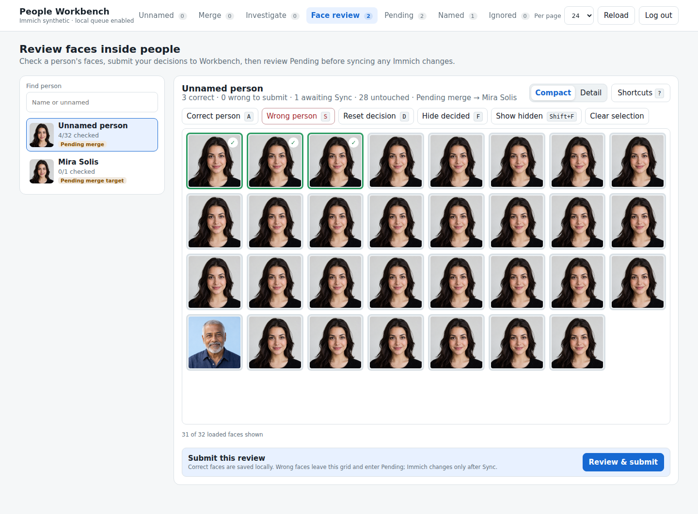

# Face review

[Visual tour](../visual-tour.md) · [User guide](../user-guide.md)

**Face review** checks the faces assigned to a person in Immich. People with
unsynced names or merges remain available here, so you can correct an obvious
mistake before sending the person change to Immich.

Compact mode shows many face crops at once. Use the arrow keys to move focus,
then mark **Correct person** (`A`) or **Wrong person** (`S`). Click or Shift-click
to select a group for the same actions. Detail mode gives
each crop more room and a **Photo** action (`P`) for context. The green and red
borders are local review drafts, saved across reloads; they do not enter Pending
or change Immich yet.

Press **Hide decided** (`F`) to hide the green and red faces marked so far.
Marking another face leaves it visible until you press `F` again, giving you a
chance to correct a mistake. **Show hidden** (`Shift+F`) brings them back.

Choose **Submit review** to confirm the marked faces. Correct faces remain
green. Wrong faces leave this person's grid and become face-correction requests
in Pending, where you can inspect, exclude, or remove them. Removing a request
returns its face to Face review.

Only an explicit Pending Sync moves a wrong face to a new unnamed person in
Immich. When a rename or merge depends on that correction, Sync applies the
face correction first. If it fails or is excluded, the dependent person change
stays in Pending instead of being applied prematurely.

Next: [Pending and Sync](pending.md) to review those requests.
