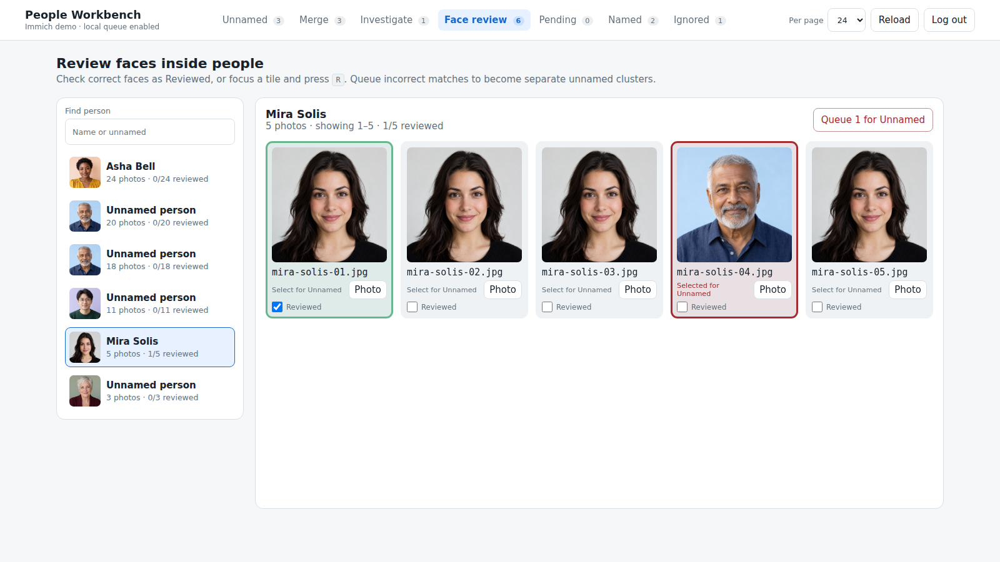
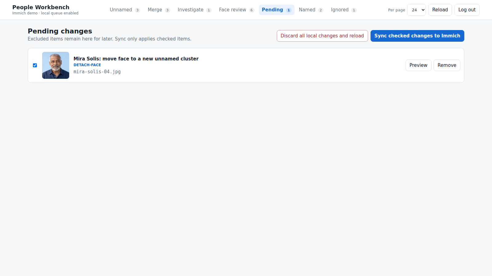

# Face review

[Visual tour](../visual-tour.md) · [User guide](../user-guide.md)

**Face review** checks individual faces already assigned to a person. Select
someone in the left list to see their face crops. Use **Photo** on a tile to
view more of its Immich photo before deciding.

Check **Reviewed** on a correct face, or focus its tile and press `R`. This
progress is local Workbench state; it does not change Immich. In the synthetic
example, one correct face is Reviewed and a different person's face has been
selected for removal from Mira Solis.

Click a wrong face's tile, then choose **Queue selected for Unnamed**. The
face appears as a separate item in Pending, where it can still be excluded,
previewed, or removed from the queue.

Only an explicit Pending Sync creates the new unnamed person and reassigns
that face in Immich. It then enters the usual naming flow. If Sync fails,
the item remains available for review and retry.

Next: [Pending and Sync](pending.md) to review the queued face.
