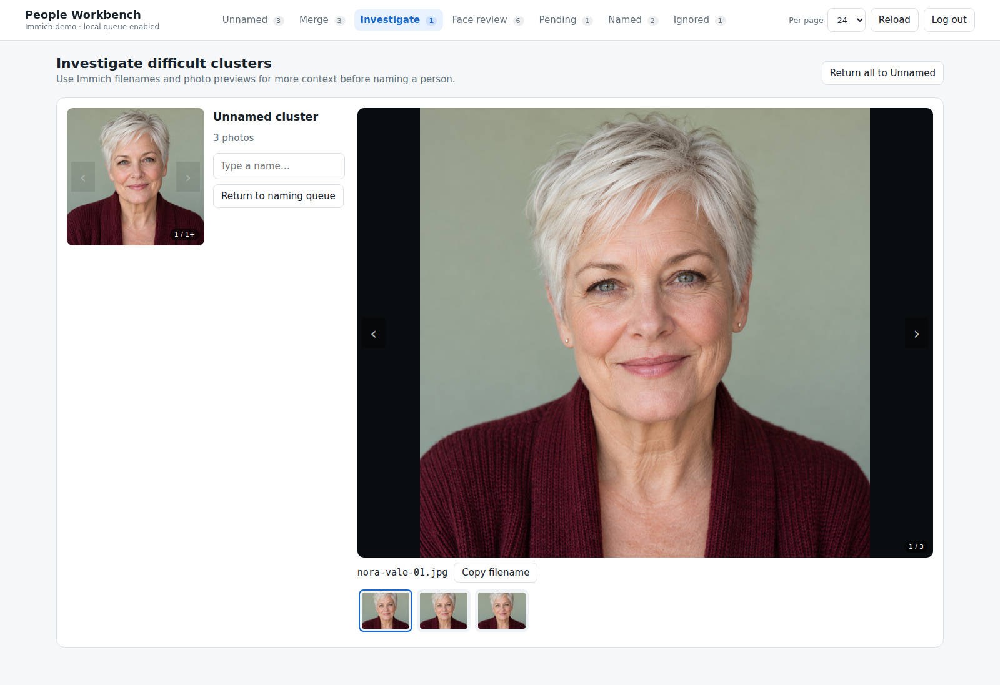

# Investigate difficult clusters

[Visual tour](../visual-tour.md) · [User guide](../user-guide.md)

When a face thumbnail is not enough, press `Alt+D` in **Unnamed** or choose
**Investigate** on its card. This moves the cluster into a separate local list
without queueing an Immich change.

The Investigate view shows a larger portrait, filenames, a photo preview, and
a thumbnail strip. Use the arrows to browse previews, click the large image
for a bigger view, or copy a filename to help find the photo in Immich. This
demo repeats one fictional portrait across its sample photos; a real library
shows the available Immich previews.

When you know the person, use the same name field and suggestions as in
[Naming people](naming.md); `Enter` queues the result in Pending. **Return to
naming queue** moves one cluster back without changing Immich. **Return all to
Unnamed** does the same for the whole Investigate list after confirmation.

Next: [Face review](face-review.md) to check assignments inside a person.
