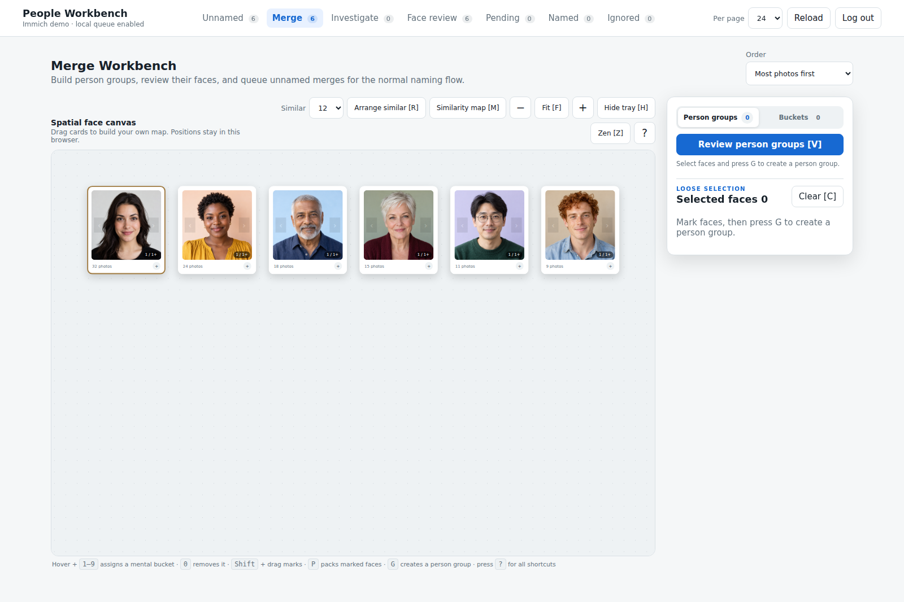
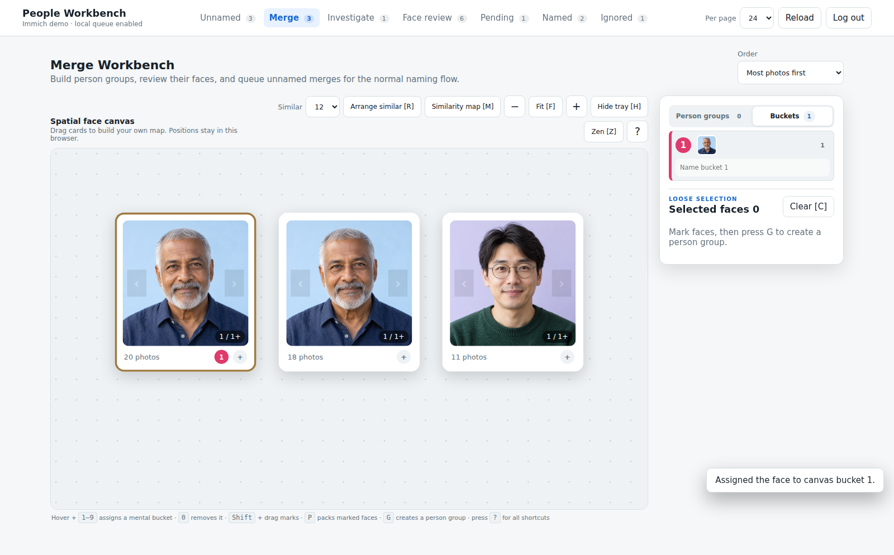
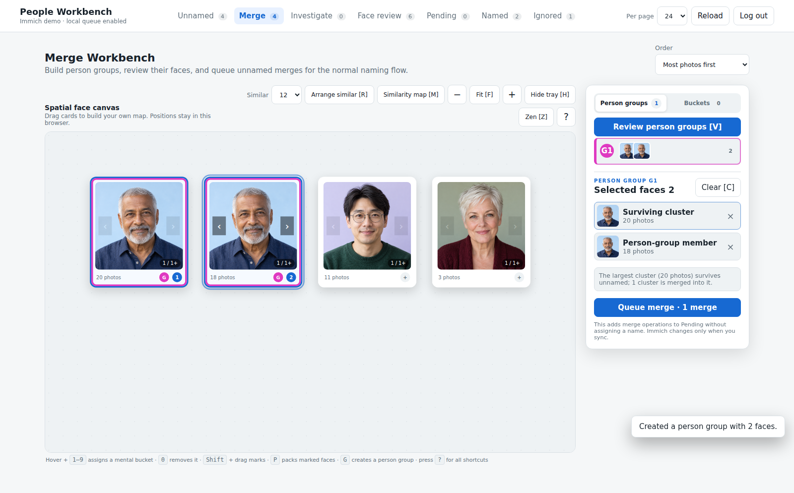
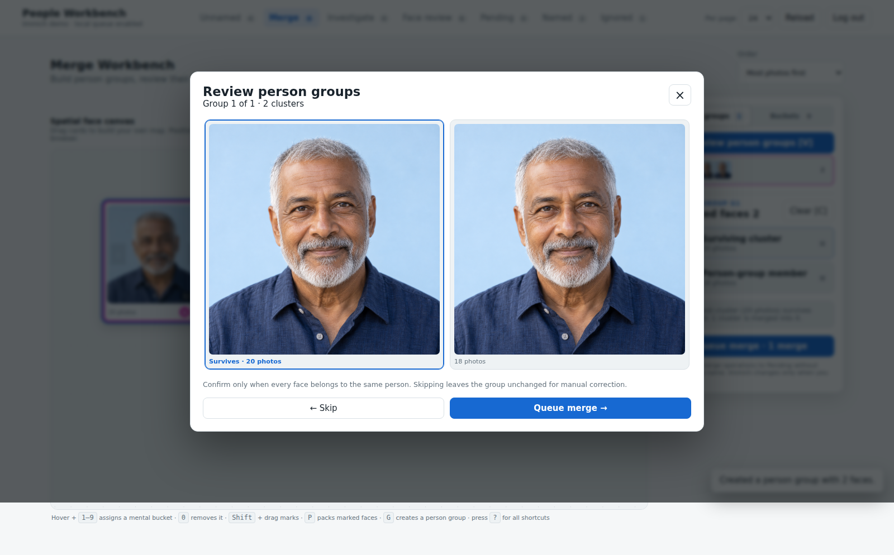

# Merge canvas

[Visual tour](../visual-tour.md) · [User guide](../user-guide.md)

**Merge** shows available unnamed clusters on a spatial canvas. Drag cards to
organize them, drag empty space to pan, use `+` / `-` to zoom, and press `F`
to fit the layout. Positions and zoom stay in this browser.

## Buckets help you sort

Hover a card and press `1`–`9` to place it in a numbered bucket; `0` removes
it. Buckets can be named in the tray. They are mental categories, such as
"check later," and never queue a merge by themselves.

## Person groups are merge candidates

Click cards to mark them, then press `G` to make a person group. You can also
mark several cards with `Shift` + drag. The tray shows group members and the
cluster with the most photos that would survive. Creating or editing a group
is still local organization.

Choose **Review person groups** or press `V` to inspect each group. Confirm
only if every face belongs to the same person; **Skip** leaves the group for
correction. Confirmation queues an *unnamed* merge in Pending. After Sync, the
surviving unnamed cluster returns to the normal naming flow.

**Arrange similar** and **Similarity map** use Immich's face ranking to move
available, unassigned cards on the local canvas. They do not automatically
group, queue, or sync people. The `?` button shows all canvas shortcuts.

Next: [Naming people](naming.md) for a resolved cluster, or
[Pending and Sync](pending.md) for a confirmed merge.
