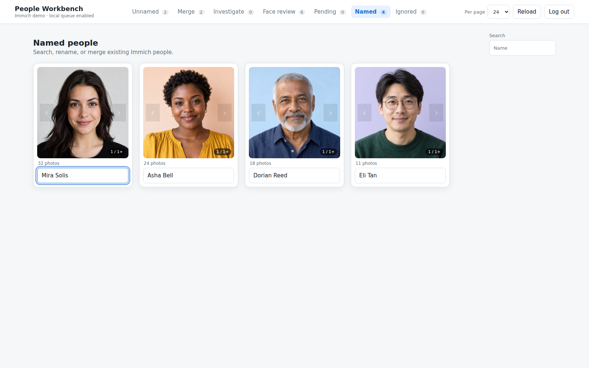
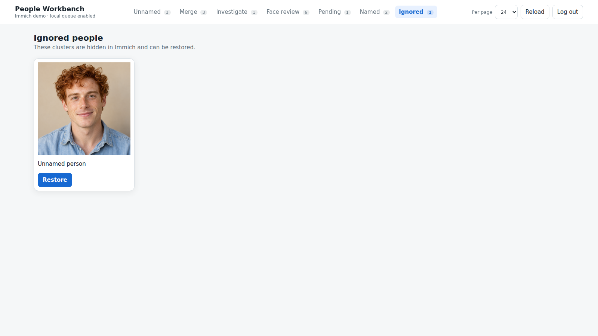

# Named, Ignored, and navigation

[Visual tour](../visual-tour.md) · [User guide](../user-guide.md)

After explicit Sync, named people appear in **Named**. Search by name, edit a
name, or choose an existing person from suggestions to queue a merge. These
edits also go through Pending before they reach Immich.

**Ignored** lists people hidden in Immich. Choosing **Restore** queues an
unhide action in Pending; Sync applies it. The screenshot shows a fictional
ignored cluster, not a person hidden from a real library.

The header counts help you move among the seven sections. **Per page** changes
the page size for lists; the Merge canvas remains a single layout. Each section
has its own URL, so reload and browser Back or Forward keep your place. The
**Reload** button refreshes people from Immich, while local Pending changes
remain available for review.

Workbench's local SQLite state and browser canvas layout are explained in
[Getting started](../getting-started.md). To start again with a new cluster,
return to [Naming people](naming.md).
