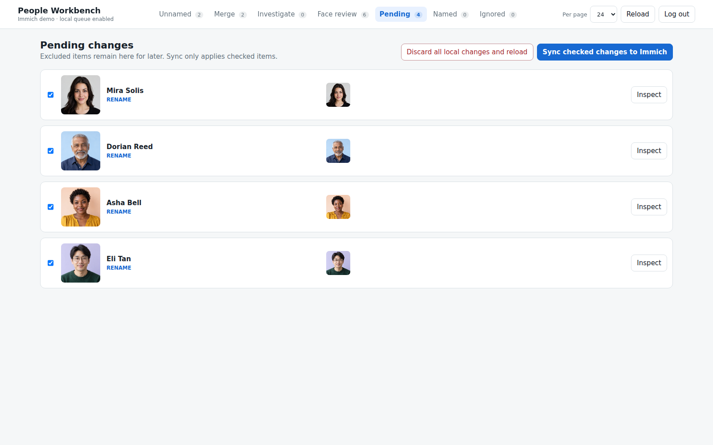
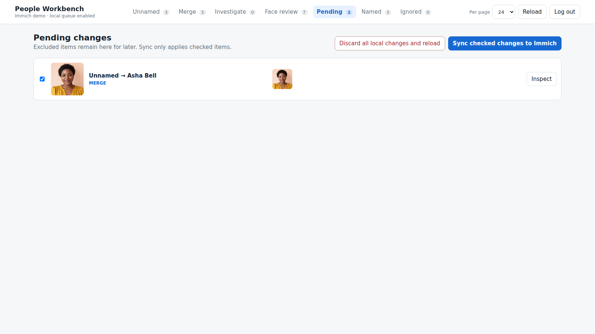

# Pending and Sync

[Visual tour](../visual-tour.md) · [User guide](../user-guide.md)

**Pending** is the review boundary for Immich changes: renames, merges,
hiding or restoring people, and moving a wrong face to a new unnamed cluster.
Queueing an action does not call an Immich write endpoint.

The list shows each proposed change and its representative face. Checkboxes
decide which items the next Sync includes. Unchecking one leaves it in Pending
for later. **Inspect** lets you review a cluster and correct its queued name
or return it to naming.

Choosing an existing person from name suggestions produces a merge item like
this one. The example uses two synthetic clusters for Asha Bell.

**Sync checked changes to Immich** is the explicit write step. Review the
checked items first; unchecked items stay queued. If an operation fails,
Workbench keeps it in Pending with an error so you can review and retry it.
The local state directory also keeps Sync reports.

**Discard all local changes and reload** removes unsynced Pending actions
after confirmation. It does not undo changes already synced to Immich or
erase local skip rounds and settings. See [Getting started](../getting-started.md)
for where private local state is stored.

Next: [Named, Ignored, and navigation](named-ignored.md) to see the resulting
views.
